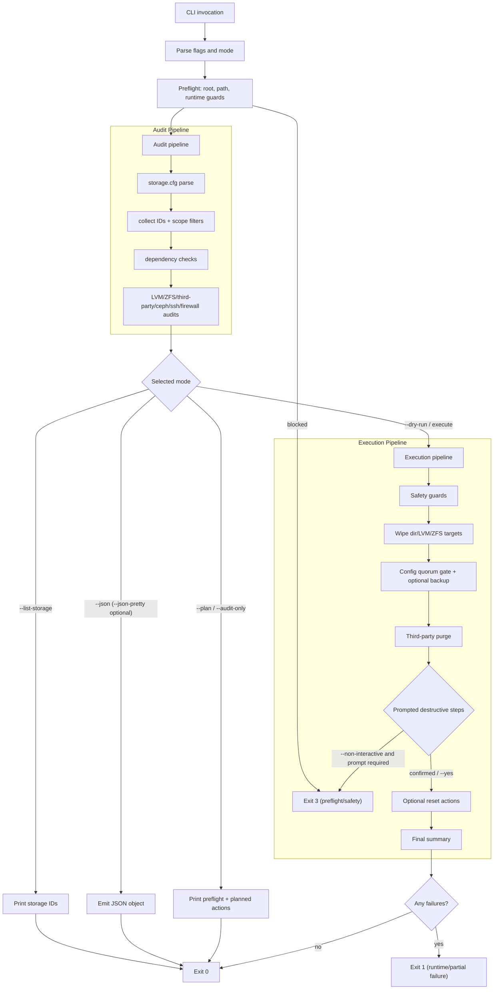
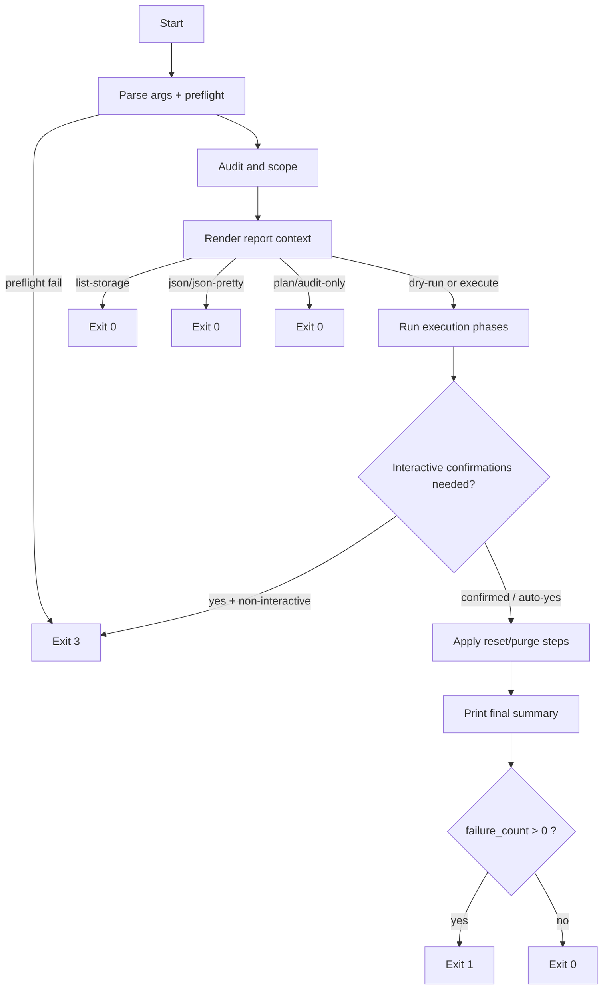

# pve-soft-reset

[](https://github.com/sebastian/pve-soft-reset/actions/workflows/ci.yml)

Audit-based soft reset for Proxmox VE hosts, without reinstalling the OS.

The script audits the current host state, derives actions from live data, and can then execute or simulate cleanup/reset steps. Third-party package detection is based on APT origin (Debian, Proxmox, and optionally Ceph).

**Requirements:** Bash 4+, Proxmox VE host; root (or equivalent) is required for execute mode.

## What It Does

- Audits `storage.cfg` and derives directory/LVM/ZFS wipe targets.
- Detects third-party packages by APT origin.
- Optionally resets Proxmox config artifacts (VM/CT configs, SDN, mappings, jobs, firewall, HA).
- Optionally resets users/datacenter config to a minimal baseline.
- Supports safe planning and scoping before execution.

## Key Safety Features

- Explicit preflight checks and dedicated preflight exit code.
- Storage path allowlist with blacklist protection for dangerous bases.
- `--plan` mode for deterministic no-side-effect planning.
- `--dry-run` mode for execution simulation.
- Storage ID scoping via include/exclude filters.
- `--non-interactive` guard to block accidental prompt waits in unattended runs.

## How It Works



## Lifecycle



List-storage and json exit after the audit; plan and audit exit after the report; dry-run and execute continue through execution phases to the final summary.

## Quickstart

1. Show deterministic plan only:

```bash
./pve-soft-reset.sh --plan
```

2. Simulate full execution:

```bash
./pve-soft-reset.sh --dry-run
```

3. Execute for real:

```bash
sudo ./pve-soft-reset.sh
```

4. Scope to selected storages:

```bash
./pve-soft-reset.sh --plan --include-storage local,local-lvm
```

5. Write a report artifact while planning:

```bash
./pve-soft-reset.sh --plan --report-file ./plan.report.txt
```

6. Emit pretty JSON for automation/debug readability:

```bash
./pve-soft-reset.sh --json --json-pretty
```

## Exit Codes

- `0`: success
- `1`: runtime/partial failure
- `2`: CLI usage error
- `3`: preflight/safety blocker

## Documentation

- [Changelog](CHANGELOG.md)
- [CLI Reference](docs/cli.md)
- [JSON Output Schema](docs/json-schema.md)
- [Testing Guide](docs/testing.md)
- [Release Checklist](docs/release-checklist.md)
- [Draft Release Notes](docs/release-notes-draft.md)
- [Release Prep Inventory](docs/release-prep-inventory.md)

## Testing

```bash
bash -n pve-soft-reset.sh
shellcheck -x pve-soft-reset.sh
shellcheck -x lib/*.bash
./scripts/check-doc-links.sh
bats tests
```

## Migration Notes (v1.2.0)

- No breaking CLI or JSON changes.
- New flags are optional: `--non-interactive`, `--report-file`, `--json-pretty`.
- JSON output remains backward compatible; additive fields are available under `meta` and `warnings`.

## License

See [LICENSE](LICENSE).
